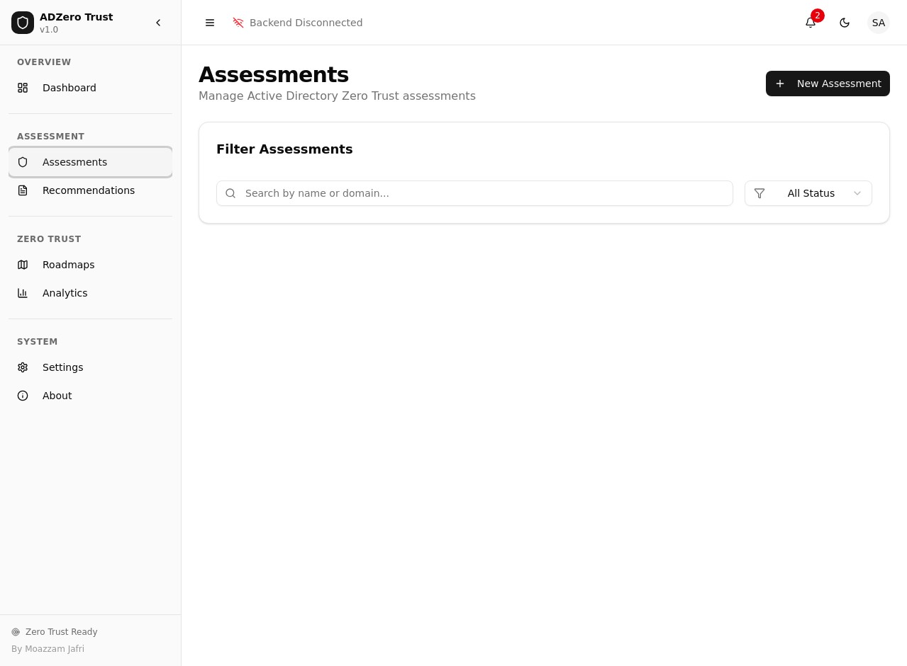
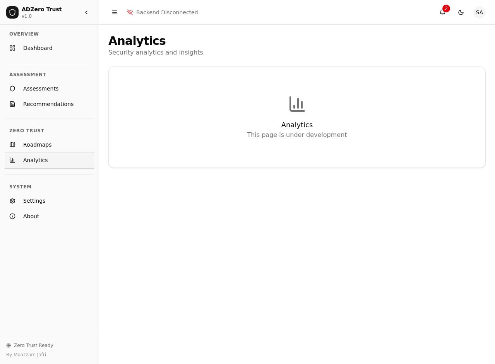
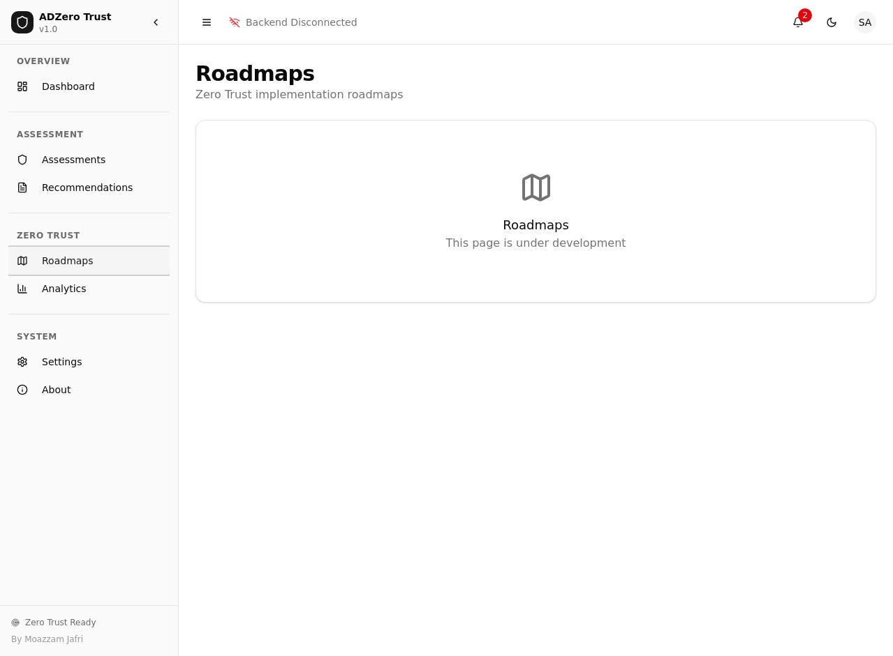
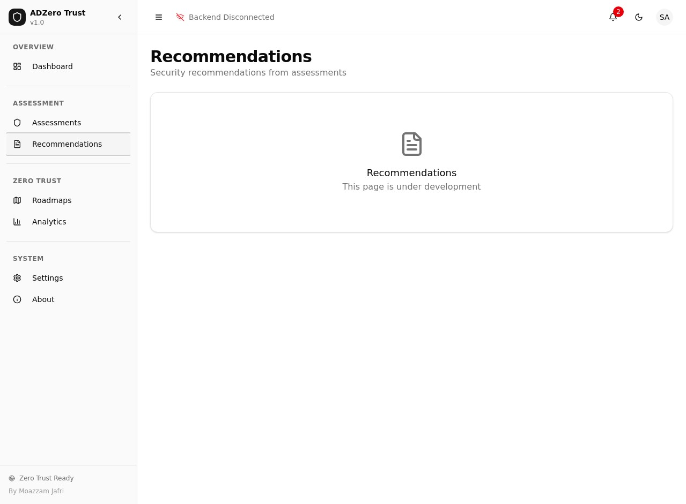
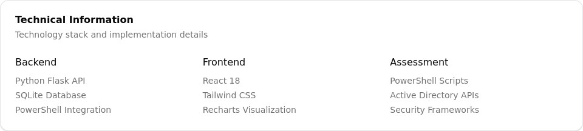

# ADZero Trust

**Active Directory Zero Trust Assessment Tool**

[](https://opensource.org/licenses/MIT)
[](https://www.python.org/downloads/)
[](https://reactjs.org/)
[](https://docs.microsoft.com/en-us/powershell/)

> *"Giving back to the community that has given me so much throughout my career."* - **Moazzam Jafri**

## 🎯 Overview

ADZero Trust is a comprehensive, interactive Active Directory Zero Trust assessment tool designed to help organizations transition from traditional perimeter-based security to modern Zero Trust architectures. This tool leverages 25+ years of cybersecurity expertise to provide actionable insights, detailed roadmaps, and comprehensive analysis of your Active Directory environment.

## 📸 Screenshots

### Dashboard Overview
The main dashboard provides a comprehensive overview of your Zero Trust posture with real-time metrics and key performance indicators.


### Assessment Management
Manage and track all your Active Directory Zero Trust assessments with detailed filtering and search capabilities.



### Security Analytics
Advanced analytics and insights page showing security trends, risk analysis, and compliance metrics.



### Implementation Roadmaps
Detailed Zero Trust implementation roadmaps tailored to your organization's current maturity level.



### Security Recommendations
Prioritized security recommendations based on assessment results and risk analysis.



### About & Project Information
Information about the project, author Moazzam Jafri, and the community contribution mission.


### Key Features Overview
Comprehensive feature overview showing the tool's capabilities and technical architecture.



### Key Features

- **🔍 Comprehensive Assessment**: Complete Active Directory security analysis using automated PowerShell scripts
- **🎯 Zero Trust Roadmaps**: Detailed implementation roadmaps tailored to your organization's maturity level
- **👥 Identity Analysis**: Advanced analysis of both human and non-human identities with risk scoring
- **🔐 Permission Auditing**: Comprehensive permission and access control analysis with least privilege recommendations
- **📊 Interactive Dashboard**: Modern, responsive web dashboard with real-time analytics and visualizations
- **📋 Compliance Checking**: Built-in compliance assessment against NIST, ISO 27001, CIS Controls, and other frameworks
- **🚨 Risk Assessment**: Advanced risk calculation engine with prioritized mitigation recommendations
- **📈 Maturity Assessment**: Zero Trust maturity evaluation across seven key dimensions
- **📄 Comprehensive Reporting**: Detailed reports with executive summaries and technical recommendations

## 🏗️ Architecture

ADZero Trust follows a modern three-tier architecture designed for scalability, security, and ease of use:

### Frontend (React Dashboard)
- **Technology**: React 18, Tailwind CSS, Recharts
- **Features**: Interactive dashboards, real-time analytics, responsive design
- **Components**: Assessment management, roadmap visualization, compliance tracking

### Backend (Python API)
- **Technology**: Flask, SQLite, RESTful APIs
- **Features**: PowerShell integration, data processing, analysis engine
- **Components**: Assessment APIs, analysis engine, reporting system

### Assessment Engine (PowerShell Scripts)
- **Technology**: PowerShell 5.1+, Active Directory modules
- **Features**: Automated data collection, security analysis, compliance checking
- **Components**: Identity analysis, permission auditing, security configuration assessment

## 🚀 Quick Start

### Prerequisites

Before installing ADZero Trust, ensure you have the following prerequisites:

- **Windows Server 2016+** or **Windows 10/11** with Active Directory access
- **PowerShell 5.1+** with Active Directory module
- **Python 3.8+** with pip
- **Node.js 16+** with npm/pnpm
- **Domain Administrator** or equivalent privileges for comprehensive assessment

### Installation

1. **Clone the Repository**
   ```bash
   git clone https://github.com/moazzamjafri/adzero-trust.git
   cd adzero-trust
   ```

2. **Set Up Backend**
   ```bash
   cd Backend/adzero_backend
   python -m venv venv
   source venv/bin/activate  # On Windows: venv\Scripts\activate
   pip install -r requirements.txt
   ```

3. **Set Up Frontend**
   ```bash
   cd Frontend/adzero-dashboard
   npm install  # or pnpm install
   ```

4. **Configure PowerShell Environment**
   ```powershell
   # Run as Administrator
   Set-ExecutionPolicy -ExecutionPolicy RemoteSigned -Scope LocalMachine
   Import-Module ActiveDirectory
   ```

### Running the Application

1. **Start the Backend API**
   ```bash
   cd Backend/adzero_backend
   source venv/bin/activate
   python src/main.py
   ```

2. **Start the Frontend Dashboard**
   ```bash
   cd Frontend/adzero-dashboard
   npm run dev
   ```

3. **Access the Dashboard**
   Open your browser and navigate to `http://localhost:5173`

## 📖 Usage Guide

### Creating Your First Assessment

1. **Navigate to Assessments**: Click on "Assessments" in the sidebar
2. **Create New Assessment**: Click "New Assessment" button
3. **Configure Assessment**: 
   - Enter assessment name and description
   - Select target domain
   - Choose assessment type (Quick, Standard, or Comprehensive)
4. **Run Assessment**: Click "Run Assessment" to start the PowerShell analysis
5. **Monitor Progress**: Track assessment progress in real-time
6. **Review Results**: Analyze results, recommendations, and roadmaps

### Understanding Assessment Results

#### Zero Trust Score
Your Zero Trust Score is calculated across six key dimensions:
- **Identity Verification** (25%): MFA coverage, password policies, privileged accounts
- **Device Compliance** (20%): Device security posture and compliance
- **Network Segmentation** (15%): Network architecture and micro-segmentation
- **Data Protection** (15%): Encryption, data governance, and protection controls
- **Application Security** (15%): Application security controls and zero trust integration
- **Monitoring & Analytics** (10%): Visibility, logging, and threat detection

#### Maturity Levels
- **Traditional (0-30%)**: Legacy perimeter-based security model
- **Initial (30-50%)**: Basic zero trust controls implemented
- **Intermediate (50-75%)**: Comprehensive zero trust implementation
- **Advanced (75-100%)**: Mature zero trust architecture with automation

#### Risk Assessment
Risks are categorized into four levels:
- **Critical (75-100)**: Immediate action required
- **High (50-75)**: High priority remediation
- **Medium (25-50)**: Moderate risk requiring attention
- **Low (0-25)**: Low risk, monitor and maintain

### PowerShell Scripts

ADZero Trust includes comprehensive PowerShell modules for automated assessment:

#### Core Modules
- **AD-InfoGatherer.ps1**: Collects comprehensive Active Directory information
- **Identity-Analyzer.ps1**: Analyzes user accounts, service accounts, and privileged access
- **Permission-Assessor.ps1**: Evaluates permissions, group memberships, and access rights
- **Security-Auditor.ps1**: Assesses security configurations and compliance

#### Running Manual Assessments
```powershell
# Import the ADZero Trust modules
Import-Module .\PowerShell\Modules\AD-InfoGatherer.ps1
Import-Module .\PowerShell\Modules\Identity-Analyzer.ps1

# Run comprehensive assessment
.\PowerShell\Scripts\Start-ADZeroTrustAssessment.ps1 -Domain "contoso.com" -OutputPath "C:\Assessments"
```

## 🔧 Configuration

### Backend Configuration

The backend can be configured through environment variables or the configuration file:

```python
# config.py
DATABASE_URL = "sqlite:///adzero_trust.db"
SECRET_KEY = "your-secret-key-here"
POWERSHELL_TIMEOUT = 3600  # 1 hour
MAX_ASSESSMENT_SIZE = 100000  # Maximum number of objects to assess
```

### Frontend Configuration

Frontend configuration is handled through environment variables:

```bash
# .env
REACT_APP_API_BASE_URL=http://localhost:5000
REACT_APP_ENVIRONMENT=development
REACT_APP_VERSION=1.0.0
```

### PowerShell Configuration

PowerShell scripts can be configured through parameters:

```powershell
# Assessment configuration
$AssessmentConfig = @{
    IncludeServiceAccounts = $true
    AnalyzePermissions = $true
    CheckCompliance = $true
    GenerateReports = $true
    ExportFormat = "JSON"
}
```

## 📊 Features Deep Dive

### Identity Analysis

The identity analysis engine provides comprehensive assessment of:

**Human Identities**
- User account security posture
- Multi-factor authentication coverage
- Password policy compliance
- Account lockout and security settings
- Privileged access patterns
- Dormant and stale accounts

**Non-Human Identities**
- Service account inventory and analysis
- Application identity assessment
- Managed service identity evaluation
- Certificate-based authentication review
- API and system account security

**Risk Scoring**
Each identity is assigned a risk score based on:
- Authentication methods and strength
- Privilege level and access patterns
- Account age and activity
- Security policy compliance
- Anomalous behavior indicators

### Permission Assessment

The permission assessment engine analyzes:

**Access Rights Analysis**
- File system permissions and inheritance
- Share permissions and network access
- Registry permissions and system access
- Database permissions and data access
- Application-specific permissions

**Group Membership Analysis**
- Security group membership patterns
- Nested group relationships
- Administrative group membership
- Distribution group usage
- Group-based access control effectiveness

**Least Privilege Assessment**
- Excessive permission identification
- Unused permission detection
- Permission aggregation analysis
- Role-based access control gaps
- Privilege escalation paths

### Zero Trust Roadmap Generation

ADZero Trust generates customized implementation roadmaps based on:

**Current Maturity Assessment**
- Baseline security posture evaluation
- Gap analysis against zero trust principles
- Organizational readiness assessment
- Resource and capability evaluation

**Phased Implementation Plan**
- **Phase 1: Foundation** (3-6 months)
  - Identity and access management
  - Basic monitoring and logging
  - Policy framework establishment
  
- **Phase 2: Expansion** (6-12 months)
  - Device security and compliance
  - Network segmentation implementation
  - Application security controls
  
- **Phase 3: Optimization** (12-18 months)
  - Advanced analytics and automation
  - Continuous compliance monitoring
  - Behavioral analysis and response

**Success Metrics and KPIs**
- Zero Trust Score improvement targets
- Risk reduction milestones
- Compliance achievement goals
- Operational efficiency metrics

### Compliance Framework Support

ADZero Trust provides built-in support for major compliance frameworks:

**NIST Cybersecurity Framework**
- Identify, Protect, Detect, Respond, Recover functions
- Category and subcategory mapping
- Implementation tier assessment
- Profile development guidance

**ISO 27001**
- Information security management system requirements
- Control objective mapping and assessment
- Risk management integration
- Continuous improvement processes

**CIS Controls**
- Critical security controls implementation
- Implementation group prioritization
- Safeguard assessment and scoring
- Measurement and metrics guidance

**Additional Frameworks**
- SOX compliance for financial controls
- PCI DSS for payment card security
- GDPR for data protection and privacy
- HIPAA for healthcare information security

## 🛡️ Security Considerations

### Data Protection

ADZero Trust implements comprehensive data protection measures:

**Data Encryption**
- All data encrypted at rest using AES-256
- TLS 1.3 for data in transit
- Database encryption with key management
- Secure configuration file handling

**Access Controls**
- Role-based access control (RBAC)
- Multi-factor authentication support
- Session management and timeout
- Audit logging for all access

**Privacy Protection**
- Personal data anonymization options
- Data retention policy enforcement
- GDPR compliance features
- Consent management capabilities

### Deployment Security

**Secure Installation**
- Integrity verification for all components
- Secure default configurations
- Hardening guidelines and checklists
- Security baseline recommendations

**Network Security**
- Network segmentation recommendations
- Firewall configuration guidance
- Secure communication protocols
- VPN and remote access considerations

**Operational Security**
- Regular security updates and patches
- Vulnerability management processes
- Incident response procedures
- Security monitoring and alerting

## 🤝 Contributing

We welcome contributions from the cybersecurity community! ADZero Trust is designed to be a collaborative effort to improve organizational security posture.

### How to Contribute

1. **Fork the Repository**: Create your own fork of the ADZero Trust repository
2. **Create Feature Branch**: `git checkout -b feature/your-feature-name`
3. **Make Changes**: Implement your improvements or bug fixes
4. **Add Tests**: Ensure your changes include appropriate tests
5. **Update Documentation**: Update relevant documentation
6. **Submit Pull Request**: Create a pull request with detailed description

### Contribution Guidelines

**Code Standards**
- Follow PEP 8 for Python code
- Use ESLint and Prettier for JavaScript/React code
- Include comprehensive comments and documentation
- Maintain backward compatibility where possible

**Testing Requirements**
- Unit tests for all new functionality
- Integration tests for API endpoints
- PowerShell script testing with Pester
- Frontend component testing with Jest

**Documentation Standards**
- Update README for new features
- Include inline code documentation
- Provide usage examples
- Update API documentation

### Areas for Contribution

**High Priority**
- Additional compliance framework support
- Enhanced PowerShell module functionality
- Advanced analytics and machine learning
- Mobile-responsive dashboard improvements

**Medium Priority**
- Integration with SIEM platforms
- Custom reporting templates
- Multi-language support
- Performance optimizations

**Community Requests**
- Cloud environment assessment support
- Hybrid identity analysis
- Advanced threat modeling
- Automated remediation capabilities

## 📄 License

ADZero Trust is released under the MIT License, ensuring maximum community benefit and adoption.

```
MIT License

Copyright (c) 2024 Moazzam Jafri

Permission is hereby granted, free of charge, to any person obtaining a copy
of this software and associated documentation files (the "Software"), to deal
in the Software without restriction, including without limitation the rights
to use, copy, modify, merge, publish, distribute, sublicense, and/or sell
copies of the Software, and to permit persons to whom the Software is
furnished to do so, subject to the following conditions:

The above copyright notice and this permission notice shall be included in all
copies or substantial portions of the Software.

THE SOFTWARE IS PROVIDED "AS IS", WITHOUT WARRANTY OF ANY KIND, EXPRESS OR
IMPLIED, INCLUDING BUT NOT LIMITED TO THE WARRANTIES OF MERCHANTABILITY,
FITNESS FOR A PARTICULAR PURPOSE AND NONINFRINGEMENT. IN NO EVENT SHALL THE
AUTHORS OR COPYRIGHT HOLDERS BE LIABLE FOR ANY CLAIM, DAMAGES OR OTHER
LIABILITY, WHETHER IN AN ACTION OF CONTRACT, TORT OR OTHERWISE, ARISING FROM,
OUT OF OR IN CONNECTION WITH THE SOFTWARE OR THE USE OR OTHER DEALINGS IN THE
SOFTWARE.
```

## 👨‍💻 About the Author

**Moazzam Jafri** — a cyber security leader with more than two decades of experience managing security programs for multinational organizations.


### Mission Statement
*"This tool represents my commitment to giving back to the cybersecurity community that has provided me with incredible opportunities throughout my career. By sharing this comprehensive assessment tool, I hope to help organizations of all sizes improve their security posture and successfully implement Zero Trust architectures."*

### Connect with Moazzam
- **LinkedIn**: [linkedin.com/in/moazzam-jafri-96136050](https://www.linkedin.com/in/moazzam-jafri-96136050/)


## 🙏 Acknowledgments

ADZero Trust would not be possible without the contributions and inspiration from:

- The cybersecurity community for continuous knowledge sharing
- Microsoft for comprehensive Active Directory documentation and tools
- NIST for the Cybersecurity Framework and security guidelines
- The open-source community for foundational technologies and libraries
- Organizations worldwide who have shared their Zero Trust implementation experiences

## 📞 Support

### Community Support
- **GitHub Issues**: Report bugs and request features
- **Discussions**: Join community discussions and share experiences
- **Wiki**: Access comprehensive documentation and guides
- **FAQ**: Find answers to frequently asked questions

### Professional Support
For organizations requiring professional support, training, or custom implementations:
- **Email**: support@adzero-trust.com
- **Consulting**: Custom assessment and implementation services
- **Training**: Zero Trust architecture and implementation training
- **Support Packages**: Professional support and maintenance contracts

## 🔄 Changelog

### Version 1.0.0 (Current)
- Initial release with comprehensive assessment capabilities
- Interactive React dashboard with real-time analytics
- Complete PowerShell assessment modules
- Zero Trust maturity assessment and roadmap generation
- Multi-framework compliance checking
- Advanced risk assessment and recommendation engine

### Planned Features (v1.1.0)
- Cloud environment assessment support
- Enhanced machine learning analytics
- Mobile application for executives
- Advanced threat modeling capabilities
- SIEM integration and automated alerting
- Custom reporting templates and branding

---

**ADZero Trust** - Empowering organizations to achieve Zero Trust maturity through comprehensive assessment and actionable insights.

*Built with ❤️ by Moazzam Jafri for the cybersecurity community*

